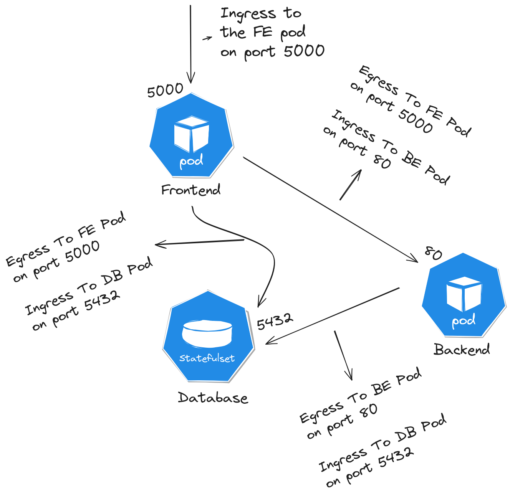
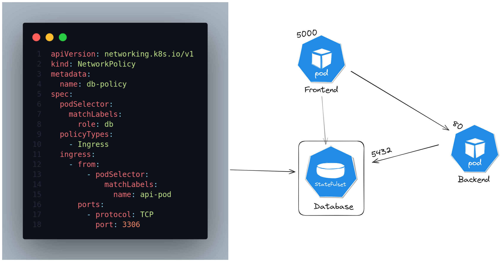

# devops-journey

# CKAD (Certified Kubernetes Application Developer)
## Notes on containerization 
### What is the `init container` in kuberentes pod ?
- init containers are basically used when you have a multi-container pod and some containers must run at the beginning of the pod and finished then the other normal containers run after it 
- so we specifiy the normal containers that will always be up and running in the `containers` section and the initial running containers at the `initContainers` section.

### What is the difference between `CMD` and `ENTRYPOINT` in Dockerfile ?
- using the `CMD`, will replace the params in the dockerfile by the params that are passed when you run the container entirely.
- using the `ENTRYPOINT`, the params will be appended to what is already written into the dockerfile


- U can use the CMD with the ENTRYPOINT to provide default values for your params 


- the mapping between the `CMD` and `ENTRYPOINT` in dockerfile to k8s yaml definition : 


## Different status of a POD


## How to reference env vars from config maps : 


## What is the replicaset ?
- used to ensure that we always have the desired number of pods running and up at all time
- used for scalling the loads across multiple instances


## Readiness Probes : 


## Liveness Probes : 


## The Canary Deployment Strategy : 


- we can use a very popular tool like Istio to handle this strategy
- Canary strategy is basically distribute the traffic over the new and old deployments by following these rules : 
    - let the traffic be distributed across both deployments
    - reduce the number of traffic to the new deployment version (in plain k8s without istio, we could simply reduce the number of pods from the new deployment version so it takes less percentage of the traffic) 


## Services in K8s: 
### Endpoint in ClusterIP Service ? 
- the `Endpoint` is simple the connection between the clusterIp svc and the pod/s that this service forwards the traffik to.
- So for example if we have 2 instances of the same pod that have label `app=BE` and the svc select this label, and we accidentaly created a new deployment with a pod that has this label by accident, the endpoint field of the svc will have 3 endpoints instead of 2 and we will catch that we did something wrong from there.

### Network Polciies : 
- What is the ingress and egress rules ? 


- we might need to specify network policy to ensure that only the Backend pod can talk to the db 
- so this means we only need an ingress rule (according to the db pod) from the backend pod and on this specific port only 


--------
# CI/CD using Github Actions

## What is CI/CD ? 
It's a way to automate your development and deployment phases.


### CI in details : 


### CD in details : 


### The difference between Continuous Delivery and Deployment concepts : 


## What is the workflow ? 
- Automated process for executing tasks.
- All your workflows are located at `.github/workflows/`.
- A Workflow is triggered via an event, so each workflow gets fired when the specific `on` event occured.

## Notes On workflows : 
### your jobs are running on a separate virtual machine `Runner`, so they have no access on your codebase (repo), so you have to allow the job to clone the repo to be able to access the files and folders.

### The default behaviour of a workflow is to run jobs in parallel, so if your flow depends on running the jobs in sequence use `needs` field in the jobs
```yaml
name: First Workflow 
on: push
jobs:
  
  build-job:
    runs-on: ubuntu-22.04
    steps:
      - name: checkout-repo
        uses: actions/checkout@v4

      - name: list-all-files
        run: ls 
    
      - name: create-test-file
        run: touch username.txt


  test-job:
    needs: [build-job] # so we can pass an array of jobs 
    runs-on: ubuntu-22.04
    steps:
      - name: checkout-repo
        uses: actions/checkout@v4

      - name: list-all-files
        run: ls 
    
      - name: play-with-files
        run: cat username.txt # this job will fail because it doesn't see the changes from the 1st job
    
  deploy-job:
    needs: [test-job] 
    runs-on: ubuntu-22.04
    steps:
      - name: deploy-flow
        uses: bla bla

```

### But we often will need to share files between jobs, for example you might have a java app and you need to build it to get a .jar file and then use ths .jar file to be tested in the test-job, so to do this use the upload and download artifact actions 
```yaml
name: First Workflow 
on: push
jobs:
  
  build-job:
    runs-on: ubuntu-22.04
    steps:
      - name: checkout-repo
        uses: actions/checkout@v4

      - name: list-all-files
        run: ls 
    
      - name: create-test-file
        run: touch username.txt
      
      - name: upload required files for other jobs
        uses: actions/upload-artifact@v3
        with: 
          name: username-credentials-file # the name u will need to download this artifact in later jobs 
          path: username.txt


  test-job:
    needs: [build-job] # so we can pass an array of jobs 
    runs-on: ubuntu-22.04
    steps:
      - name: checkout-repo
        uses: actions/checkout@v4

      - name: list-all-files
        run: ls 

      - name: upload required files for other jobs
        uses: actions/download-artifact@v3
        with: 
          name: username-credentials-file 
    
      - name: play-with-files
        run: cat username.txt # this job will fail because it doesn't see the changes from the 1st job
    
  deploy-job:
    needs: [test-job] 
    runs-on: ubuntu-22.04
    steps:
      - name: upload required files for other jobs
        uses: actions/download-artifact@v3
        with: 
          name: username-credentials-file 
    
      - name: deploy-flow
        uses: bla bla

```